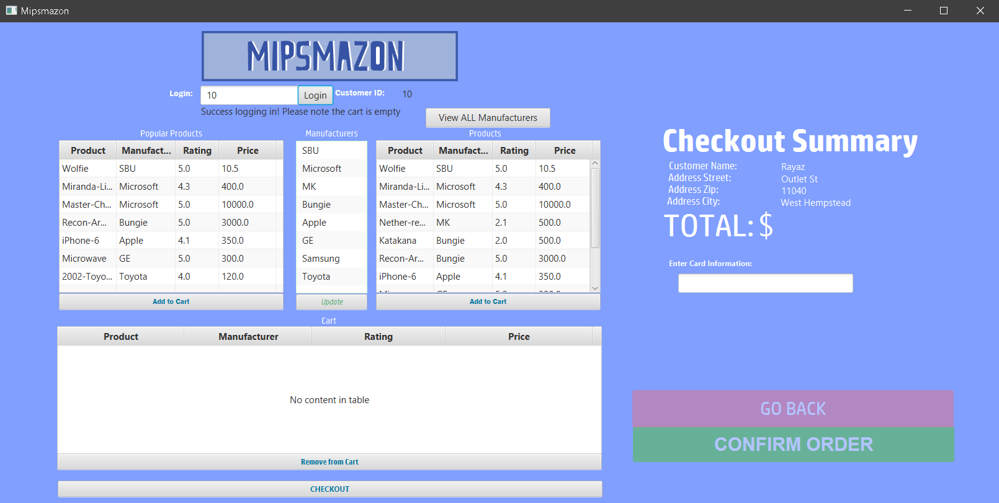
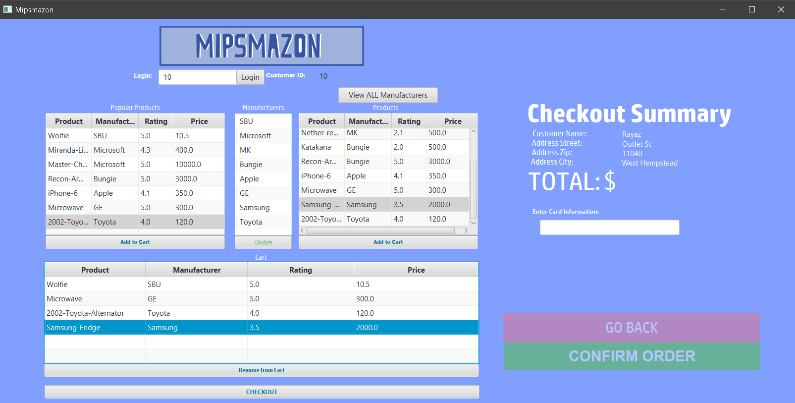
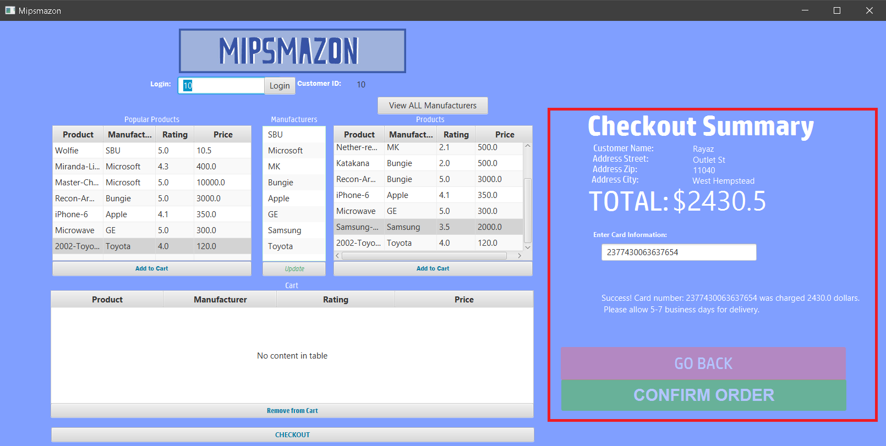

User Logs into Mipsmazon:

User adds items to their own unique cart. 
SQL data base updates accordingly for each product that gets added to the cart

User checks out, inputs their card information and hits confirm order:
Likewise the customer order schema is updated in the database as the transaction completes

